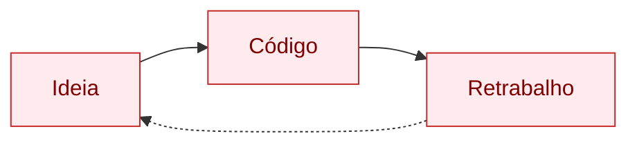

## Step 1: Setup & Por que não começar pelo código

> Cenário: você recebe uma tarefa — "construa um app de previsão do tempo". O impulso natural é abrir o editor e começar a digitar. Mas o que acontece quando você descobre, na hora do code review, que o cliente queria mostrar a previsão de 7 dias e você construiu apenas o dia atual? **Spec-Driven Development começa com uma pergunta: o que exatamente precisa ser construído e por quê?**

### Conceito

Times costumam começar pelo código e só descobrem no code review que construíram a coisa errada — e cada correção tardia custa retrabalho. O SDD inverte a ordem: antes de escrever qualquer linha, você prepara um ambiente reproduzível e captura o que já se sabe (e o que ainda não se sabe) sobre o problema. O diagrama abaixo contrasta os dois caminhos — o ciclo reativo de código→bug→código e o fluxo do SDD, em que a verificação vem por último justamente porque a intenção foi definida primeiro.

#### Sem SDD



#### Com SDD


### Objetivo

Preparar o ambiente SDD e registrar o discovery — a base sobre a qual a spec será construída. São dois artefatos, cada um com um papel claro:

| Artefato | Por que existe |
|---|---|
| `.github/copilot-instructions.md` | Ensina as regras do SDD ao assistente de IA do projeto |
| `specs/discovery.md` | Captura contexto, problema e restrições **antes** da spec formal |

### Mãos à obra: Configure o ambiente SDD

**Parte A — Crie sua branch de trabalho**

Os workflows de validação deste exercício disparam em push para qualquer branch **exceto** `main` — então todo o exercício (Steps 1 a 7) acontece em uma única branch, criada agora e reutilizada até o Step 8, quando ela é integrada em `main` via Pull Request.

1. Crie a branch:

   ```bash
   git checkout -b weather-app
   ```

2. A partir daqui, todos os commits e `git push` deste exercício acontecem na branch `weather-app` — não volte para `main` até o Step 8.

**Parte B — Crie as instruções SDD para o Copilot**

Este arquivo é lido automaticamente pelo Copilot e faz o assistente respeitar a ordem `spec → plan → tasks → code`. Ajuste o conteúdo à vontade — o importante é registrar as regras do projeto.

1. Crie o arquivo `.github/copilot-instructions.md` com o seguinte conteúdo:

   ```markdown
   # Instruções SDD para GitHub Copilot

   ## Princípio fundamental
   Neste projeto, seguimos Spec-Driven Development. O código é a última etapa, não a primeira.

   ## Antes de gerar código, sempre verifique:
   - Existe uma spec aprovada em `specs/`?
   - Existe um plano técnico em `plans/`?
   - As tasks estão definidas em `tasks/`?

   ## Regras de geração de código
   - Todo código deve rastrear-se a um critério de aceite na spec
   - Nenhuma funcionalidade sem spec; nenhum teste sem critério de aceite
   - Prefira funções puras e tipagem estrita (TypeScript strict mode)
   - Documente decisões de design, não apenas o "como"

   ## Stack do projeto
   - React 18 + TypeScript strict + Vite
   - Vitest + Testing Library (unit/integration)
   - Playwright (E2E)
   - Biome (lint/format)
   - Tailwind CSS

   ## API
   - Open-Meteo (geocoding + forecast, sem API key)
   - Endpoints: geocoding-api.open-meteo.com e api.open-meteo.com
   ```

**Parte C — Crie o Discovery Document**

O discovery separa o que já sabemos das perguntas em aberto. Ele fica em `specs/` junto da spec formal do Step 2, mas **não é a spec** — é o documento que responde: "o que sabemos, o que não sabemos, e o que precisamos descobrir antes de especificar?" Repare como cada pergunta em aberto aqui vira uma decisão explícita na spec do próximo step.

1. Crie a pasta `specs/` na raiz do repositório.
2. Crie o arquivo `specs/discovery.md` com o seguinte conteúdo:

   ```markdown
   # Discovery: Weather App

   ## Contexto
   Exercício de Spec-Driven Development usando um aplicativo de previsão do tempo como domínio.

   ## Problema a resolver
   Usuários precisam consultar rapidamente a previsão do tempo para qualquer cidade do mundo,
   sem precisar criar conta ou fornecer localização automaticamente.

   ## Restrições conhecidas
   - Sem backend próprio (app estático, deploy em GitHub Pages)
   - Sem API key (usar Open-Meteo, que é gratuito e sem autenticação)
   - Tecnologia: React + TypeScript + Vite

   ## Perguntas em aberto (a responder na Spec)
   - [ ] Quantos dias de previsão mostrar?
   - [ ] Como lidar com múltiplos resultados para o mesmo nome de cidade?
   - [ ] A temperatura deve ser exibida em Celsius, Fahrenheit ou ambas?
   - [ ] Como tratar erros de rede?

   ## Stakeholders
   - Learner (desenvolvedor aprendendo SDD)
   - Instrutor (quem valida o exercício)

   ## Critérios mínimos de sucesso
   - Usuário consegue buscar cidade por nome
   - Usuário vê temperatura atual e condição climática
   - App funciona sem autenticação
   ```

3. Faça commit e push dos dois arquivos:

   ```bash
   git add .github/copilot-instructions.md specs/discovery.md
   git commit -m "step 1: setup SDD environment and discovery document"
   git push -u origin weather-app
   ```

> [!IMPORTANT]
> O workflow de validação verificará se os arquivos existem. Certifique-se de incluir todos no commit.

### Checkpoint

O Step 1 é aprovado quando estes arquivos existem no repositório:

- [ ] `.github/copilot-instructions.md`
- [ ] `specs/discovery.md`

Só a existência é verificada — o conteúdo é seu ponto de partida, não uma resposta fixa. Nos próximos steps, além dos arquivos, o workflow passa a checar também seções e testes específicos.

### Em outras ferramentas

| Ferramenta | Como aborda o setup inicial |
|---|---|
| **spec-kit** | Usa `/specify` para iniciar o processo; cria automaticamente a pasta `.specify/` com templates de spec |
| **OpenSpec** | O repositório de specs fica em `openspec/specs/`; o discovery equivale a uma "change proposal" inicial |
| **BMAD-METHOD** | O agente "Analyst" conduz o discovery em conversas estruturadas, produzindo um "Project Brief" antes da spec |

<details>
<summary>Problemas?</summary><br/>

- **"git push falhou"**: certifique-se de que você está na branch `weather-app` (criada na Parte A) e que tem permissão de escrita no repositório.
- **"O workflow não disparou"**: vá em Actions e verifique se o workflow "Step 1" está habilitado. Se não estiver, aguarde o Step 0 terminar de configurar o exercício.
- **Arquivos não aparecem no repositório**: certifique-se de ter feito `git add` para os dois arquivos antes do commit.

</details>
