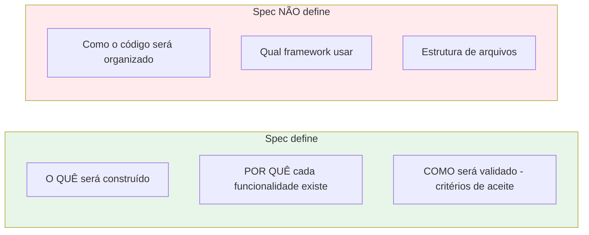

## Step 2: Escrevendo a Especificação

> Você tem o discovery em mãos. Agora é hora de responder: **o que exatamente vai ser construído?** Uma spec não é um documento burocrático — é um contrato entre o que foi pedido e o que será entregue. E, mais importante: cada requisito vira um **critério de aceite testável**.

### Conceito

A spec responde **o quê** será construído, **por quê** cada funcionalidade existe e **como validar** que foi entregue (os critérios de aceite) — mas nunca **como implementar** (arquitetura, framework, organização de código — isso é o Plan, no próximo step). Ela é o contrato entre o que foi pedido e o que será entregue, e cada requisito precisa virar um critério de aceite verificável. O que fica de fora é tão importante quanto o que entra: por isso a spec separa explicitamente o que ela define do que ela não define.



**Anatomia de um critério de aceite (Acceptance Criteria):**

```
DADO que [contexto/estado inicial]
QUANDO [ação do usuário ou sistema]
ENTÃO [resultado esperado e verificável]
```

Exemplo:
```
DADO que o usuário digitou "São Paulo" no campo de busca
QUANDO ele clica em "Buscar"
ENTÃO o sistema exibe uma lista com pelo menos uma opção de localização contendo "São Paulo"
```

> [!TIP]
> Se você não consegue escrever um teste automatizado para o critério de aceite, ele provavelmente não está claro o suficiente.

### Objetivo

Transformar o discovery em uma spec com critérios de aceite testáveis. A spec precisa conter três seções que o próximo agente (e o workflow de validação) esperam encontrar: **Escopo**, **Fora de escopo** e **Critérios de Aceite**.

### Mãos à obra: Escreva a spec do Weather App

Cada critério de aceite abaixo já está escrito no formato DADO/QUANDO/ENTÃO para poder virar teste diretamente. Ao colar, leia-os como uma lista de promessas que o código terá de cumprir.

1. Crie o arquivo `specs/weather-app-spec.md` com o seguinte conteúdo:

   ```markdown
   # Especificação: Weather App

   ## Escopo
   Aplicação web estática para consulta de previsão do tempo por cidade,
   usando a API Open-Meteo (sem autenticação).

   ## Fora de escopo
   - Detecção automática de localização (GPS)
   - Histórico de buscas persistido
   - Notificações push
   - Previsão por hora (apenas diária)
   - Suporte a múltiplos idiomas (apenas português)

   ## Funcionalidades

   ### F1 — Busca de cidade
   **Critérios de Aceite:**
   - CA1.1: DADO que o campo de busca está vazio, ENTÃO o botão "Buscar" está desabilitado
   - CA1.2: DADO que o usuário digitou o nome de uma cidade válida, QUANDO clicar em "Buscar", ENTÃO o sistema exibe até 5 sugestões de localização
   - CA1.3: DADO que a cidade digitada não existe, QUANDO a busca retornar vazia, ENTÃO o sistema exibe "Nenhuma cidade encontrada"
   - CA1.4: DADO que ocorreu um erro de rede durante a busca, ENTÃO o sistema exibe mensagem de erro amigável

   ### F2 — Exibição do clima atual
   **Critérios de Aceite:**
   - CA2.1: DADO que o usuário selecionou uma cidade, ENTÃO o sistema exibe temperatura atual em Celsius
   - CA2.2: DADO que o usuário selecionou uma cidade, ENTÃO o sistema exibe sensação térmica
   - CA2.3: DADO que o usuário selecionou uma cidade, ENTÃO o sistema exibe ícone/emoji representando a condição climática
   - CA2.4: DADO que o usuário selecionou uma cidade, ENTÃO o sistema exibe velocidade do vento (km/h) e umidade relativa (%)
   - CA2.5: DADO que a requisição de previsão está em andamento, ENTÃO o sistema exibe indicador de carregamento

   ### F3 — Conversão de temperatura
   **Critérios de Aceite:**
   - CA3.1: A conversão de Celsius para Fahrenheit segue a fórmula F = (C × 9/5) + 32
   - CA3.2: 0°C = 32°F
   - CA3.3: 100°C = 212°F
   - CA3.4: -40°C = -40°F

   ### F4 — Mapeamento de condições climáticas (WMO)
   **Critérios de Aceite:**
   - CA4.1: Código WMO 0 é mapeado para "Céu limpo" com emoji ☀️
   - CA4.2: Código WMO 95 é mapeado para "Tempestade" com emoji ⛈️
   - CA4.3: Códigos WMO desconhecidos retornam "Condição desconhecida" com emoji ❓

   ### F5 — Previsão de 7 dias
   **Critérios de Aceite:**
   - CA5.1: DADO que o usuário selecionou uma cidade, ENTÃO o sistema exibe a previsão dos próximos 7 dias
   - CA5.2: DADO a previsão de um dia, ENTÃO o sistema exibe a temperatura máxima e a mínima daquele dia
   - CA5.3: DADO a previsão de um dia, ENTÃO o sistema exibe o emoji da condição climática (código WMO) daquele dia

   ## Restrições técnicas
   - API: Open-Meteo (geocoding-api.open-meteo.com e api.open-meteo.com)
   - Stack: React 18 + TypeScript strict + Vite
   - Deploy: GitHub Pages (build estático)
   - Sem API key necessária

   ## Métricas de qualidade
   - Cobertura de testes unitários: ≥ 80% das funções em `src/lib/`
   - Todos os critérios de aceite cobertos por testes automatizados
   - Build sem erros de TypeScript (strict mode)
   - Lint sem erros (Biome)
   ```

2. Faça commit e push:

   ```bash
   git add specs/weather-app-spec.md
   git commit -m "step 2: weather app specification with acceptance criteria"
   git push origin weather-app
   ```

> [!IMPORTANT]
> O workflow de validação verificará se o arquivo existe e contém as seções obrigatórias ("Critérios de Aceite", "Escopo", "Fora de escopo"). Certifique-se de manter esses termos exatamente como estão.

### Checkpoint

O Step 2 é aprovado quando `specs/weather-app-spec.md` existe e contém, com o texto exato, as seções:

- [ ] `Escopo`
- [ ] `Fora de escopo`
- [ ] `Critérios de Aceite`

Você pode adaptar os critérios, mas mantenha esses três títulos — são as âncoras que garantem a validação determinística.

### Em outras ferramentas

| Ferramenta | Como trata a especificação |
|---|---|
| **spec-kit** | O comando `/specify` gera um template de spec em `.specify/specs/`; os critérios de aceite são usados pelo `/tasks` para gerar tasks diretamente |
| **OpenSpec** | A spec vive em `openspec/specs/` e é versionada como código; mudanças de requisito passam por "change proposals" com revisão formal |
| **BMAD-METHOD** | O agente "PM" (Product Manager) produz o PRD (Product Requirements Document) a partir das notas do Analyst; o agente "Architect" depois usa esse PRD para o design técnico |

<details>
<summary>Problemas?</summary><br/>

- **"Workflow falhou com 'seção não encontrada'"**: verifique se os títulos "Critérios de Aceite", "Escopo" e "Fora de escopo" estão presentes exatamente como no template.
- **"Arquivo não encontrado"**: certifique-se de que o arquivo está em `specs/weather-app-spec.md` (observe a pasta `specs/`, não `spec/`).
- **Dúvida sobre critérios de aceite**: pense sempre em termos de "DADO / QUANDO / ENTÃO" — se não consegue formular assim, o requisito pode estar vago demais.

</details>
