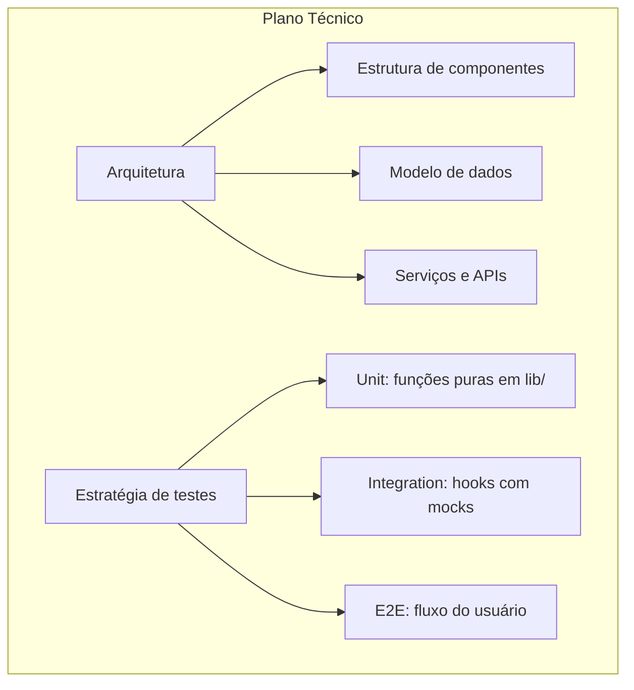
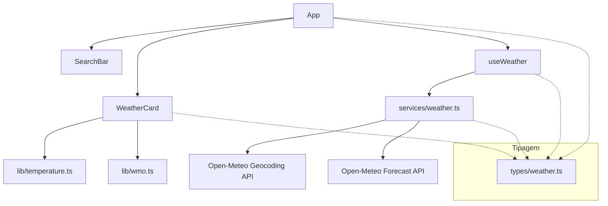

## Step 3: Do Spec ao Plano Técnico

> Com a spec aprovada, é hora de responder: **como isso será construído?** O plano técnico não é uma burocracia — é onde as decisões de arquitetura são tomadas de forma consciente, e onde a **estratégia de testes** é definida antes de qualquer linha de código.

### Conceito

Se a spec diz **o quê**, o plano técnico diz **como**. É aqui que a arquitetura, o modelo de dados e — principalmente — a estratégia de testes são decididos de forma consciente, antes de existir qualquer código. Um bom plano também registra as decisões que foram *descartadas* e o porquê, para a equipe não refazer o mesmo debate depois.



**Diagrama de arquitetura do Weather App:**



> [!NOTE]
> Um plano técnico inclui também **as decisões que foram descartadas** e o motivo. Isso evita que a equipe refaça o mesmo debate no futuro.

### Objetivo

Derivar da spec um plano técnico com arquitetura, modelo de dados e estratégia de testes, e registrar um agente que saiba reproduzir esse formato. Dois artefatos:

| Artefato | Por que existe |
|---|---|
| `plans/weather-app-plan.md` | Decisões de arquitetura, dados e testes rastreadas aos critérios de aceite |
| `.github/agents/plan.agent.md` | Persona reutilizável que gera planos nesse mesmo formato |

### Mãos à obra: Crie o plano técnico e o agente de planejamento

**Parte A — Crie o plano técnico**

Repare na tabela de decisões e no mapeamento "critério de aceite → teste": é isso que torna o plano verificável, e não só uma lista de intenções.

1. Crie a pasta `plans/` na raiz do repositório.
2. Crie o arquivo `plans/weather-app-plan.md`:

   ````markdown
   # Plano Técnico: Weather App

   ## Arquitetura geral
   Aplicação SPA (Single Page Application) estática, sem backend próprio.
   Toda comunicação com APIs externas é feita diretamente do browser.

   ### Estrutura de diretórios
   ```
   src/
   ├── components/    # Componentes React de apresentação
   ├── hooks/         # Custom hooks (lógica de estado)
   ├── services/      # Acesso a APIs externas (Open-Meteo)
   ├── lib/           # Funções puras testáveis (conversões, formatação, WMO)
   ├── types/         # TypeScript types/interfaces
   └── styles/        # CSS global (Tailwind)
   ```

   ## Modelo de dados

   ### Location (geocoding)
   ```typescript
   interface Location {
     id: number;
     name: string;
     latitude: number;
     longitude: number;
     country: string;
     country_code: string;
     admin1?: string; // estado/região
   }
   ```

   ### WeatherData (forecast)
   ```typescript
   interface WeatherData {
     location: Location;
     current: {
       temperature_2m: number;
       apparent_temperature: number;
       weather_code: number; // WMO code
       wind_speed_10m: number;
       relative_humidity_2m: number;
     };
     daily: {
       time: string[];
       temperature_2m_max: number[];
       temperature_2m_min: number[];
       weather_code: number[];
     };
   }
   ```

   ## Decisões técnicas

   | Decisão | Escolha | Alternativas descartadas | Motivo |
   |---|---|---|---|
   | Estado assíncrono | `AsyncState<T>` union type | Redux, Zustand | Escopo pequeno; union type resolve com zero deps |
   | Linting/Formatting | Biome | ESLint + Prettier | Uma única ferramenta, mais rápida, configuração unificada |
   | CSS | Tailwind CSS | CSS Modules, styled-components | Produtividade; utilitários inline evitam contexto de mudança |
   | Testes E2E | Playwright | Cypress | Suporte nativo a múltiplos browsers; melhor integração com CI |

   ## Estratégia de testes

   ### Pirâmide de testes
   ```
   E2E (Playwright) ← poucos, mas cobrem fluxos críticos da spec
       ↑
   Integration (Vitest + Testing Library) ← hooks com mocks de API
       ↑
   Unit (Vitest) ← funções puras em src/lib/ ← PRIORITÁRIOS
   ```

   ### Mapeamento spec → teste
   | Critério de aceite | Tipo de teste | Arquivo |
   |---|---|---|
   | CA3.1–CA3.4 (conversão temperatura) | Unit | `src/lib/temperature.test.ts` |
   | CA4.1–CA4.3 (mapeamento WMO) | Unit | `src/lib/wmo.test.ts` |
   | CA1.1 (botão desabilitado) | E2E | `e2e/search.spec.ts` |
   | CA1.2 (resultados de busca) | E2E | `e2e/search.spec.ts` |
   | CA2.5 (loading indicator) | Integration | `src/hooks/useWeather.test.ts` |

   ## APIs externas

   ### Open-Meteo Geocoding
   - URL: `https://geocoding-api.open-meteo.com/v1/search`
   - Params: `name`, `count=5`, `language=pt`, `format=json`
   - Sem API key

   ### Open-Meteo Forecast
   - URL: `https://api.open-meteo.com/v1/forecast`
   - Params: `latitude`, `longitude`, `current=...`, `daily=...`, `timezone=auto`
   - Sem API key
   ````

**Parte B — Crie o agente de planejamento**

1. Crie a pasta `.github/agents/`.
2. Crie o arquivo `.github/agents/plan.agent.md`:

   ```markdown
   # Agente: Technical Planner

   ## Persona
   Você é um arquiteto de software sênior especializado em aplicações React/TypeScript.
   Sua responsabilidade é transformar especificações de produto em planos técnicos detalhados.

   ## Input esperado
   - Especificação do produto (`specs/`)
   - Restrições técnicas conhecidas

   ## Output esperado
   Um documento `plans/[feature]-plan.md` contendo:
   1. Diagrama de arquitetura (Mermaid)
   2. Modelo de dados (TypeScript interfaces)
   3. Tabela de decisões técnicas (com alternativas descartadas)
   4. Estratégia de testes mapeada aos critérios de aceite
   5. Lista de endpoints de API com parâmetros

   ## Regras
   - Nunca especifique implementação; especifique contratos e estruturas
   - Toda decisão deve ter um "motivo" documentado
   - A estratégia de testes DEVE mapear cada critério de aceite a um tipo de teste
   - Priorize funções puras em `src/lib/` — são mais fáceis de testar

   ## Prompt de ativação
   "Com base na spec em `specs/weather-app-spec.md`, crie um plano técnico detalhado seguindo o formato de `plans/weather-app-plan.md`."
   ```

3. Faça commit e push:

   ```bash
   git add plans/weather-app-plan.md .github/agents/plan.agent.md
   git commit -m "step 3: technical plan and planning agent"
   git push origin weather-app
   ```

### Checkpoint

O Step 3 é aprovado quando existem os dois arquivos e o plano contém as seções-chave:

- [ ] `plans/weather-app-plan.md` (com os títulos `Arquitetura` e `Estratégia de testes`)
- [ ] `.github/agents/plan.agent.md`

Mantenha os títulos `Arquitetura` e `Estratégia de testes` — o workflow procura por eles.

### Em outras ferramentas

| Ferramenta | Como trata o planejamento técnico |
|---|---|
| **spec-kit** | O comando `/plan` lê a spec e gera automaticamente um plano técnico; o `/tasks` depois desdobra esse plano em tarefas granulares |
| **OpenSpec** | O plano técnico é uma "implementation proposal" separada da spec; ambas são versionadas e precisam de aprovação |
| **BMAD-METHOD** | O agente "Architect" recebe o PRD do PM e produz o "Architecture Document" com diagramas; depois o "SM" (Scrum Master) quebra em stories/tasks |

<details>
<summary>Problemas?</summary><br/>

- **"Workflow falhou com seções não encontradas"**: certifique-se de que `plans/weather-app-plan.md` contém as palavras "Arquitetura" e "Estratégia de testes".
- **"Pasta .github/agents não existe"**: crie-a com `mkdir -p .github/agents` antes de criar o arquivo.
- **Diagrama Mermaid não renderiza**: certifique-se de que o bloco começa com ` ```mermaid ` e termina com ` ``` ` (sem espaços extras). Verifique no GitHub Preview antes de fazer commit.

</details>
