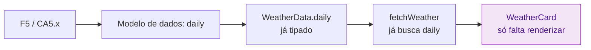

## Step 5: Code — Implemente a Previsão de 7 Dias

> As tasks estão registradas. Agora o código nasce como **consequência** delas: você vai implementar a última task pendente — a T9 (previsão de 7 dias, F5) — no `WeatherCard`.

### Conceito

Em Spec-Driven Development, escrever código não é o começo do trabalho — é a **execução de uma task que rastreia um critério de aceite**. Você não decide "o que" construir aqui; isso já foi decidido na spec (F5/CA5.x) e no plano. O código apenas materializa o que já foi especificado, nada além disso.

Repare como as camadas anteriores já prepararam o terreno:



> [!TIP]
> Quando a spec, o plano e os tipos estão prontos, a implementação vira uma tradução quase mecânica. Se você se pegar "inventando" comportamento aqui, provavelmente falta um critério de aceite na spec.

### Objetivo

Implementar a renderização da previsão de 7 dias no componente `WeatherCard`, satisfazendo CA5.1, CA5.2 e CA5.3. Ao final, `pnpm build` compila sem erros e a previsão aparece no browser.

### Mãos à obra: Renderize os próximos 7 dias

O trabalho pesado já está feito: o serviço `fetchWeather` (`src/services/weather.ts`) já busca os dados diários da Open-Meteo, e o tipo `WeatherData.daily` (`src/types/weather.ts`) já descreve a forma desses dados:

```ts
daily: {
  time: string[];
  temperature_2m_max: number[];
  temperature_2m_min: number[];
  weather_code: WmoCode[];
};
```

Hoje o `WeatherCard` renderiza **apenas o clima atual**. Falta apenas exibir o array `daily`.

1. Instale as dependências (caso ainda não tenha feito):

   ```bash
   pnpm install
   ```

2. Abra `src/components/WeatherCard.tsx` e inclua `daily` na desestruturação dos dados:

   ```tsx
   const { location, current, daily } = data;
   ```

3. Antes do `</div>` que fecha o card, adicione a seção da previsão de 7 dias:

   ```tsx
   <div className="mt-6 border-t border-gray-100 pt-4">
     <h3 className="text-sm font-semibold text-gray-700 mb-2">
       Próximos 7 dias
     </h3>
     <ul className="space-y-1">
       {daily.time.map((day, i) => (
         <li
           key={day}
           className="flex items-center justify-between text-sm text-gray-600"
         >
           <span className="w-12 font-medium">
             {new Date(day).toLocaleDateString("pt-BR", {
               weekday: "short",
             })}
           </span>
           <span
             className="text-xl"
             role="img"
             aria-label={getWmoDescription(daily.weather_code[i])}
           >
             {getWmoEmoji(daily.weather_code[i])}
           </span>
           <span className="tabular-nums">
             {formatTemperature(daily.temperature_2m_max[i], "C")} /{" "}
             {formatTemperature(daily.temperature_2m_min[i], "C")}
           </span>
         </li>
       ))}
     </ul>
   </div>
   ```

   As funções `formatTemperature`, `getWmoDescription` e `getWmoEmoji` já estão importadas no topo do arquivo — reaproveite-as para manter a consistência com o clima atual.

4. Verifique se o build passa:

   ```bash
   pnpm build
   ```

5. Rode o app em modo de desenvolvimento e confira o resultado:

   ```bash
   pnpm dev
   ```
   Acesse `http://localhost:5173`, busque uma cidade e selecione — os 7 dias devem aparecer abaixo do clima atual.

6. Faça commit e push da implementação:

   ```bash
   git add src/components/WeatherCard.tsx
   git commit -m "step 5: render 7-day forecast (F5)"
   git push origin weather-app
   ```

> [!IMPORTANT]
> O workflow de validação executa `pnpm install && pnpm build` e falha se houver erros de compilação. Como a mudança está em `src/`, o push dispara a verificação automaticamente.

### Checkpoint

O Step 5 é aprovado quando:

- [ ] `src/components/WeatherCard.tsx` renderiza os próximos 7 dias
- [ ] `pnpm build` compila sem erros de TypeScript
- [ ] A previsão de 7 dias aparece no browser após selecionar uma cidade

Repare: você não adicionou nenhuma dependência nova nem alterou tipos ou serviço. A F5 estava especificada, planejada e tipada — o código foi só o último elo.

### Em outras ferramentas

| Ferramenta | Como trata a implementação |
|---|---|
| **spec-kit** | O comando `/implement` executa cada task do `tasks.md` em sequência, gerando o código que rastreia os critérios de aceite |
| **OpenSpec** | O código entra via PR que **referencia a spec**; o merge só é permitido se a implementação corresponde à change proposal aprovada |
| **BMAD-METHOD** | O agente "Dev" implementa cada user story criada pelo SM, seguindo o Architecture Document como contrato |

<details>
<summary>Problemas?</summary><br/>

- **"'daily' does not exist on type..."**: confirme que você adicionou `daily` na desestruturação (`const { location, current, daily } = data;`).
- **"Cannot find name 'getWmoEmoji'"**: as funções já são importadas no topo do arquivo — não remova os imports existentes.
- **"A previsão não aparece"**: o card só renderiza depois de selecionar uma cidade nos resultados da busca. Verifique também o console do navegador por erros de rede.
- **"Build falhou"**: rode `pnpm tsc --noEmit` para ver todos os erros de tipo de uma vez.

</details>
