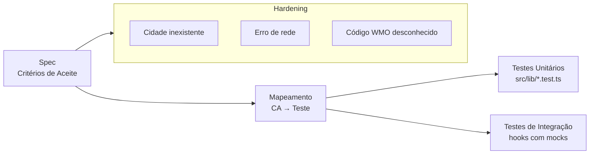

## Step 6: Verify — Test + Hardening

> O código está escrito. Mas como sabemos que ele faz o que a spec prometeu? **Testamos.** E como garantimos que os casos extremos que a spec mencionou funcionam? **Hardening.** Test e Hardening não são fases extras — são a prova de que a spec foi cumprida.

### Conceito

Testes não são uma fase extra: são a prova de que a spec foi cumprida. Cada critério de aceite vira pelo menos um teste, e os edge cases que a spec menciona explicitamente viram testes de *hardening*. Se está na spec, tem teste; se não está na spec, questione por que está no código.



**O que já existe:**

O repositório já contém os arquivos de teste:
- `src/lib/temperature.test.ts` — testa CA3.1 a CA3.4 (conversão de temperatura)
- `src/lib/wmo.test.ts` — testa CA4.1 a CA4.3 (mapeamento WMO)

### Objetivo

Rodar os testes que já derivam da spec e adicionar um teste de hardening para um edge case. Ao final, `pnpm test` deve passar — é isso que o workflow verifica.

### Mãos à obra: Execute os testes e adicione hardening

**Parte A — Execute os testes existentes**

1. Execute os testes unitários:

   ```bash
   pnpm test
   ```

   Você deve ver todos os testes passando. Observe como cada teste mapeia diretamente a um critério de aceite da spec.

2. Verifique a cobertura:

   ```bash
   pnpm test:coverage
   ```

**Parte B — Adicione um teste de hardening**

O teste de hardening para o edge case de código WMO desconhecido (CA4.3) já existe no repositório. Vamos adicionar um novo teste de hardening para a fórmula de conversão de temperatura (CA3.1) em um valor extremo:

1. Abra `src/lib/wmo.test.ts` e confirme que o teste para código desconhecido já existe (CA4.3 — nada a fazer aqui).

2. Agora adicione dois testes de hardening — um para a CA3.1 (a fórmula vale para qualquer entrada, inclusive extremos) e um para a CA2.1 (a temperatura exibida precisa ser sempre um valor correto, nunca "-0°C") — abra `src/lib/temperature.test.ts` e adicione ao final:

   ```typescript
   describe("edge cases — hardening", () => {
     it("lida com temperatura muito baixa (-273.15°C, zero absoluto)", () => {
       // Zero absoluto = -459.67°F
       expect(celsiusToFahrenheit(-273.15)).toBeCloseTo(-459.67, 0);
     });

     it("formatTemperature com zero negativo exibe 0, não -0", () => {
       const result = formatTemperature(-0, "C");
       expect(result).toBe("0°C");
     });
   });
   ```

3. Execute os testes novamente para confirmar que passam:

   ```bash
   pnpm test
   ```

4. Faça commit e push:

   ```bash
   git add src/lib/temperature.test.ts
   git commit -m "step 6: hardening tests for edge cases"
   git push origin weather-app
   ```

> [!IMPORTANT]
> O workflow de validação executará `pnpm test` e falhará se qualquer teste falhar.

> [!NOTE]
> **Por que hardening não é "gold-plating"?** Hardening cobre os edge cases de uma regra que **já está** na spec — não cria comportamento novo. A CA3.1 diz "a conversão segue a fórmula F = (C × 9/5) + 32", sem limitar a faixa de entrada; testar em -273.15°C (zero absoluto) só prova que a mesma fórmula, já prometida, se sustenta em um extremo. O mesmo vale para a CA4.3 ("código WMO desconhecido retorna fallback"): é obrigação explícita da spec, não um extra inventado pelo desenvolvedor.

### Checkpoint

O Step 6 é aprovado quando `pnpm test` passa. O workflow roda toda a suíte — os testes existentes já bastam para aprovar, e o teste de hardening que você adicionou reforça a cobertura dos edge cases da spec.

### Em outras ferramentas

| Ferramenta | Como trata testes e hardening |
|---|---|
| **spec-kit** | Após `/implement`, o `/review` verifica se os critérios de aceite têm cobertura de teste; sugere testes ausentes |
| **OpenSpec** | A spec define "test requirements" como seção obrigatória; PR só é aprovado se todos os test requirements tiverem testes correspondentes |
| **BMAD-METHOD** | O agente "QA" recebe o PRD e o código, e produz um "Test Plan" cobrindo happy path, edge cases e critérios de aceite; o agente "Dev" implementa os testes faltantes |

<details>
<summary>Problemas?</summary><br/>

- **"Testes falham com erros de import"**: verifique se os arquivos `src/lib/temperature.ts` e `src/lib/wmo.ts` existem.
- **"vitest: command not found"**: execute `pnpm install` primeiro para instalar as dependências.
- **"Por que o teste de -0 passa?"**: o JavaScript tem `-0` e `0` como valores distintos, mas a função `formatTemperature` já normaliza esse caso (`rounded === 0 ? 0 : rounded`), então o teste passa sem alterações. Se você reescrever a função e o teste começar a falhar, é sinal de que perdeu essa normalização — garanta que `-0` seja exibido como `0`.

</details>
