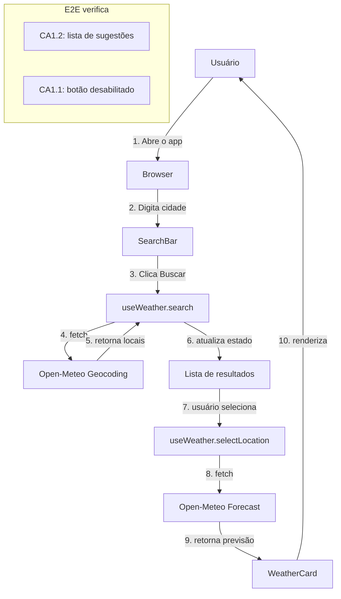

## Step 7: E2E — A Spec pelos Olhos do Usuário

> Testes unitários verificam funções isoladas. Mas o usuário não usa funções — ele usa o sistema inteiro. Testes E2E são **a spec vista pelos olhos do usuário**: eles simulam exatamente o que um humano faria no browser.

### Conceito

Testes unitários verificam funções isoladas; testes E2E verificam o sistema inteiro pelos olhos do usuário. Eles simulam exatamente o que uma pessoa faria no browser — digitar, clicar, esperar o resultado — e por isso validam o fluxo completo da spec. Um E2E não substitui os testes unitários: quando ele falha, são os unitários que ajudam a isolar onde está o problema.



### Objetivo

Rodar os testes E2E que validam o fluxo do usuário e adicionar um teste para o estado de carregamento. Ao final, `pnpm test:e2e` deve passar — é o que o workflow executa (com o Chromium instalado).

### Mãos à obra: Execute e expanda os testes E2E

**Parte A — Instale os browsers do Playwright**

1. Se ainda não instalou os browsers (fora do devcontainer):

   ```bash
   pnpm exec playwright install chromium --with-deps
   ```

**Parte B — Execute os testes E2E existentes**

1. Execute os testes E2E:

   ```bash
   pnpm test:e2e
   ```

   Os testes em `e2e/search.spec.ts` devem passar. Eles verificam:
   - Exibição do título da aplicação
   - Presença do campo de busca e botão
   - Botão desabilitado quando o campo está vazio
   - Fluxo de busca por cidade

2. Veja o relatório HTML gerado:

   ```bash
   pnpm exec playwright show-report
   ```

**Parte C — Adicione um teste E2E para estado de loading**

1. Abra `e2e/search.spec.ts` e adicione o seguinte teste ao `describe` existente:

   ```typescript
   test("exibe estado de carregamento durante a busca", async ({ page }) => {
     // Intercepta a requisição para simular latência
     await page.route("**/geocoding-api.open-meteo.com/**", async (route) => {
       await new Promise((resolve) => setTimeout(resolve, 500));
       await route.continue();
     });

     await page.getByRole("searchbox").fill("London");
     await page.getByRole("button", { name: /Buscar/i }).click();

     // Verifica que o botão fica em estado de carregamento
     await expect(page.getByRole("button", { name: /Buscando/i })).toBeVisible();
   });
   ```

2. Execute os testes novamente:

   ```bash
   pnpm test:e2e
   ```

3. Faça commit e push:

   ```bash
   git add e2e/search.spec.ts
   git commit -m "step 7: e2e test for loading state"
   git push origin weather-app
   ```

> [!IMPORTANT]
> O workflow de validação executará `pnpm test:e2e` com browsers instalados. Em CI, o Playwright usa Chromium headless.

### Checkpoint

O Step 7 é aprovado quando:

- [ ] Os browsers do Playwright instalam sem erro
- [ ] `pnpm test:e2e` passa (incluindo o novo teste de carregamento)

O fluxo de busca usa a API real do Open-Meteo; se um teste falhar por rede, rode novamente antes de investigar.

### Em outras ferramentas

| Ferramenta | Como trata testes E2E |
|---|---|
| **spec-kit** | O `/review` gera uma checklist de critérios de aceite; o desenvolvedor marca quais têm cobertura E2E; não gera testes automaticamente |
| **OpenSpec** | Testes E2E são referenciados na spec como "acceptance tests"; o PR deve incluir um link para o test run antes de ser aprovado |
| **BMAD-METHOD** | O agente "QA" produz casos de teste E2E em formato Gherkin (Given/When/Then); outro agente ou o desenvolvedor converte em código Playwright/Cypress |

<details>
<summary>Problemas?</summary><br/>

- **"Browser not found"**: execute `pnpm exec playwright install chromium --with-deps`.
- **"Timeout exceeded"**: aumente o `timeout` no `playwright.config.ts` ou verifique se o app está rodando (`pnpm dev` em outro terminal).
- **"O teste de loading falha imediatamente"**: certifique-se de que o `page.route()` está antes do preenchimento do input — a interceptação deve ser configurada antes da ação.
- **"localhost:5173 recusou conexão"**: o `webServer` no `playwright.config.ts` sobe o Vite automaticamente; certifique-se de que a porta 5173 não está em uso.

</details>
