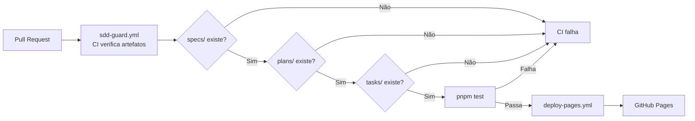

## Step 8: Review & Ship

> O código está testado. Mas antes de mergear, **a spec é o juiz**. O review rastreável verifica se o que foi implementado corresponde ao que foi prometido. Depois: deploy.

### Conceito

No review guiado por spec, a spec é o juiz: o que importa é se o implementado corresponde ao prometido, com rastreabilidade entre spec, testes e código. E para a metodologia não depender de disciplina humana, ela vira código: um workflow de CI (o *guard*) falha o PR se faltar spec, plano ou tasks. Aprovado o guard, o deploy acontece automaticamente.



> [!IMPORTANT]
> O `sdd-guard.yml` não é burocracia — é a materialização da metodologia SDD em código. Se alguém tentar fazer PR sem spec, o CI falha. A ordem `Spec → Plan → Tasks → Code` é **enforçada automaticamente**.

### Objetivo

Fechar o ciclo SDD com três artefatos que tornam a metodologia executável e entregam o app:

| Artefato | Por que existe |
|---|---|
| `.github/agents/review.agent.md` | Checklist de review focado em rastreabilidade, não em estilo |
| `.github/workflows/sdd-guard.yml` | CI que bloqueia PR sem spec/plano/tasks e roda lint/build/test |
| `.github/workflows/deploy-pages.yml` | Publica o app no GitHub Pages após o guard passar |

### Mãos à obra: Crie o review agent, o guard e o deploy

**Parte A — Agente de revisão**

1. Crie `.github/agents/review.agent.md`:

   ```markdown
   # Agente: SDD Code Reviewer

   ## Persona
   Você é um tech lead que prioriza rastreabilidade e qualidade guiada por spec.
   Você NÃO comenta estilo (o Biome já faz isso). Você verifica substância.

   ## Checklist de review (execute nesta ordem)

   ### 1. Rastreabilidade spec → código
   - [ ] Todo arquivo em `src/` tem um critério de aceite correspondente na spec?
   - [ ] Alguma funcionalidade foi implementada sem estar na spec?

   ### 2. Rastreabilidade spec → testes
   - [ ] Todos os critérios de aceite têm pelo menos um teste automatizado?
   - [ ] Os edge cases mencionados na spec têm testes de hardening?

   ### 3. Consistência plan → código
   - [ ] A estrutura de arquivos corresponde ao plano técnico?
   - [ ] As interfaces TypeScript batem com o modelo de dados do plano?

   ### 4. Completude
   - [ ] O build passa sem erros?
   - [ ] `pnpm test` passa sem falhas?
   - [ ] `pnpm test:e2e` passa sem falhas?

   ## Prompt de ativação
   "Revise este PR usando o checklist SDD. Reporte apenas problemas de rastreabilidade, funcionalidade não especificada, ou critérios de aceite sem cobertura de teste."
   ```

**Parte B — SDD Guard (CI)**

1. Crie `.github/workflows/sdd-guard.yml`:

   ```yaml
   name: SDD Guard

   on:
     push:
       branches: [main]
     pull_request:
       branches: [main]

   permissions:
     contents: read

   jobs:
     verify_artifacts:
       name: Verify SDD Artifacts
       runs-on: ubuntu-latest
       steps:
         - name: Checkout
           uses: actions/checkout@v4

         - name: Check spec exists
           run: |
             if [ ! -f "specs/weather-app-spec.md" ]; then
               echo "specs/weather-app-spec.md não encontrada"
               echo "Spec-Driven Development requer uma spec antes do código."
               exit 1
             fi
             echo "Spec encontrada"

         - name: Check plan exists
           run: |
             if [ ! -f "plans/weather-app-plan.md" ]; then
               echo "plans/weather-app-plan.md não encontrado"
               echo "Spec-Driven Development requer um plano técnico antes do código."
               exit 1
             fi
             echo "Plano técnico encontrado"

         - name: Check tasks exists
           run: |
             if [ ! -f "tasks/weather-app-tasks.md" ]; then
               echo "tasks/weather-app-tasks.md não encontrado"
               echo "Spec-Driven Development requer tasks definidas antes do código."
               exit 1
             fi
             echo "Tasks encontradas"

     build_and_test:
       name: Build and Test
       runs-on: ubuntu-latest
       needs: verify_artifacts
       steps:
         - name: Checkout
           uses: actions/checkout@v4

         - name: Setup pnpm
           uses: pnpm/action-setup@v4

         - name: Setup Node.js
           uses: actions/setup-node@v4
           with:
             node-version-file: ".nvmrc"
             cache: "pnpm"

         - name: Install dependencies
           run: pnpm install --frozen-lockfile=false

         - name: Lint
           run: pnpm lint

         - name: Build
           run: pnpm build

         - name: Test
           run: pnpm test
   ```

**Parte C — Deploy para GitHub Pages**

1. Crie `.github/workflows/deploy-pages.yml`:

   ```yaml
   name: Deploy to GitHub Pages

   on:
     push:
       branches: [main]
     workflow_dispatch:

   permissions:
     contents: read
     pages: write
     id-token: write

   concurrency:
     group: pages
     cancel-in-progress: false

   jobs:
     build:
       name: Build
       runs-on: ubuntu-latest
       steps:
         - name: Checkout
           uses: actions/checkout@v4

         - name: Setup pnpm
           uses: pnpm/action-setup@v4

         - name: Setup Node.js
           uses: actions/setup-node@v4
           with:
             node-version-file: ".nvmrc"
             cache: "pnpm"

         - name: Install dependencies
           run: pnpm install --frozen-lockfile=false

         - name: Build
           run: pnpm build

         - name: Setup Pages
           uses: actions/configure-pages@v4

         - name: Upload artifact
           uses: actions/upload-pages-artifact@v3
           with:
             path: dist

     deploy:
       name: Deploy
       environment:
         name: github-pages
         url: ${{ steps.deployment.outputs.page_url }}
       runs-on: ubuntu-latest
       needs: build
       steps:
         - name: Deploy to GitHub Pages
           id: deployment
           uses: actions/deploy-pages@v4
   ```

2. Faça commit e push (ainda na branch `weather-app`):

   ```bash
   git add .github/agents/review.agent.md .github/workflows/sdd-guard.yml .github/workflows/deploy-pages.yml
   git commit -m "step 8: review agent, SDD guard CI, and deploy to GitHub Pages"
   git push origin weather-app
   ```

> [!IMPORTANT]
> O workflow de validação verificará que `.github/workflows/sdd-guard.yml` e `.github/workflows/deploy-pages.yml` existem, e que `pnpm build` passa.

**Parte D — Abra o Pull Request e faça o merge**

Até aqui todo o trabalho ficou na branch `weather-app`. `sdd-guard.yml` e `deploy-pages.yml` só entram em ação em `main` — é o Pull Request que fecha o ciclo.

1. Abra um Pull Request de `weather-app` para `main` (pela CLI ou pela interface do GitHub):

   ```bash
   gh pr create --base main --head weather-app --title "Weather App: SDD end-to-end" --fill
   ```

2. Aguarde o `sdd-guard.yml` rodar no PR (verifica spec/plano/tasks e roda lint/build/test).
3. Com o guard verde, faça o merge do PR. O merge em `main` dispara o `deploy-pages.yml`.

### Checkpoint

O Step 8 é aprovado quando:

- [ ] `.github/workflows/sdd-guard.yml` existe
- [ ] `.github/workflows/deploy-pages.yml` existe
- [ ] `pnpm build` passa
- [ ] Pull Request de `weather-app` para `main` aberto e mergeado

Depois do merge, ative o GitHub Pages (Settings → Pages → Source: GitHub Actions) para ver o app no ar.

### Em outras ferramentas

| Ferramenta | Como trata review e ship |
|---|---|
| **spec-kit** | O `/review` gera um checklist de rastreabilidade; o developer marca os itens antes de abrir o PR |
| **OpenSpec** | Todo PR deve referenciar um spec change proposal; o merge só é permitido se todos os acceptance tests passarem no CI |
| **BMAD-METHOD** | O agente "Dev" abre o PR com a checklist do agente "QA"; o tech lead (humano) faz o review final usando os critérios do agente "Architect" |

<details>
<summary>Problemas?</summary><br/>

- **"GitHub Pages não habilitado"**: vá em Settings → Pages → Source e selecione "GitHub Actions".
- **"sdd-guard.yml falha no lint"**: execute `pnpm lint` localmente para ver os erros; corrija com `pnpm check`.
- **"deploy-pages.yml falha com 'pages not enabled'"**: ative o GitHub Pages nas configurações do repositório antes de mergear.
- **"Workflow de validação não encontra os arquivos"**: certifique-se de que os arquivos foram adicionados com `git add` e que o commit incluiu exatamente os paths esperados.

</details>
