# Spec-Driven Development: Construindo com Intenção

_Aprenda a metodologia Spec-Driven Development (SDD) construindo um Weather App real, do brief à entrega._

## Bem-vindo(a)

- **Para quem é este exercício**: Desenvolvedores que querem estruturar melhor o processo de desenvolvimento com IA, passando de "código primeiro" para "spec primeiro"
- **O que você vai aprender**:
  - A metodologia SDD de ponta a ponta, do brief à entrega (fluxo completo no diagrama abaixo)
  - Como escrever especificações com critérios de aceite testáveis
  - Como reconhecer esses conceitos em ferramentas reais de SDD ([spec-kit](https://github.com/github/spec-kit), [OpenSpec](https://github.com/Fission-AI/OpenSpec), [BMAD-METHOD](https://github.com/bmad-code-org/BMAD-METHOD))
- **O que você vai construir**: Um Weather App funcional em React + TypeScript + Vite consumindo a API Open-Meteo (sem necessidade de API key)
- **Pré-requisitos**:
  - Conhecimento básico de Git e GitHub
  - Familiaridade com TypeScript/React (nível iniciante é suficiente)
  - Conta no GitHub com acesso ao GitHub Copilot (recomendado)

- **Duração**: Este exercício leva menos de **1 hora** para ser concluído.

## Visão geral: o fluxo SDD

```mermaid
flowchart LR
    subgraph planejamento["Planejamento"]
        direction LR
        A[Brief] --> B[Spec] --> C[Plan] --> D[Tasks]
    end

    subgraph construcao["Construção"]
        E[Code]
    end

    subgraph testes["Testes"]
        direction LR
        F[Test] --> G[Hardening] --> H[E2E]
    end

    subgraph entrega["Entrega"]
        direction LR
        I[Review] --> J[Ship]
    end

    D --> E --> F
    H --> I

    classDef planning fill:#1565c0,stroke:#0d47a1,color:#ffffff
    classDef build fill:#6a1b9a,stroke:#4a148c,color:#ffffff
    classDef testing fill:#ef6c00,stroke:#e65100,color:#ffffff
    classDef release fill:#2e7d32,stroke:#1b5e20,color:#ffffff

    class A,B,C,D planning
    class E build
    class F,G,H testing
    class I,J release

    style planejamento fill:#e3f2fd,stroke:#1565c0,color:#0d47a1
    style construcao fill:#f3e5f5,stroke:#6a1b9a,color:#4a148c
    style testes fill:#fff3e0,stroke:#ef6c00,color:#e65100
    style entrega fill:#e8f5e9,stroke:#2e7d32,color:#1b5e20
```

> **O princípio que costura o fluxo**: cada etapa deriva da spec — o plano a detalha, as tasks a fatiam, o código a executa e os testes a verificam. Se um comportamento não está na spec, ele não entra no código; se é um critério de aceite, existe um teste que o prova.

## Neste exercício, você irá:

As 10 etapas do diagrama acontecem em **8 steps práticos**, com os mesmos nomes do fluxo — cada step constrói um pedaço real do Weather App:

1. **Brief** — configurar o ambiente e entender por que não começar pelo código
2. **Spec** — escrever a especificação com critérios de aceite testáveis
3. **Plan** — transformar a spec em um plano técnico com estratégia de testes
4. **Tasks** — quebrar o plano em tarefas verificáveis rastreadas à spec
5. **Code** — implementar guiado pelas tasks (a previsão de 7 dias)
6. **Test + Hardening** — verificar com testes unitários e cobrir os edge cases da spec
7. **E2E** — validar a spec pela perspectiva do usuário
8. **Review + Ship** — fazer review rastreável e configurar o deploy

### Como iniciar o exercício

Copie o exercício para sua conta, aguarde **cerca de 20 segundos** para a Mona preparar a primeira lição e depois **atualize a página**.

Problemas para começar?
 

Ao copiar o exercício, recomendamos as seguintes configurações:

- Para owner, escolha sua conta pessoal ou uma organização.
- Recomendamos criar um repositório público, pois repositórios privados consomem minutos de Actions.

Se o exercício não estiver pronto em 20 segundos, verifique a aba [Actions](../../actions).

- Verifique se há um job em execução. Às vezes demora um pouco mais.
- Se a página mostrar um job com falha, abra uma issue. Você encontrou um bug!

